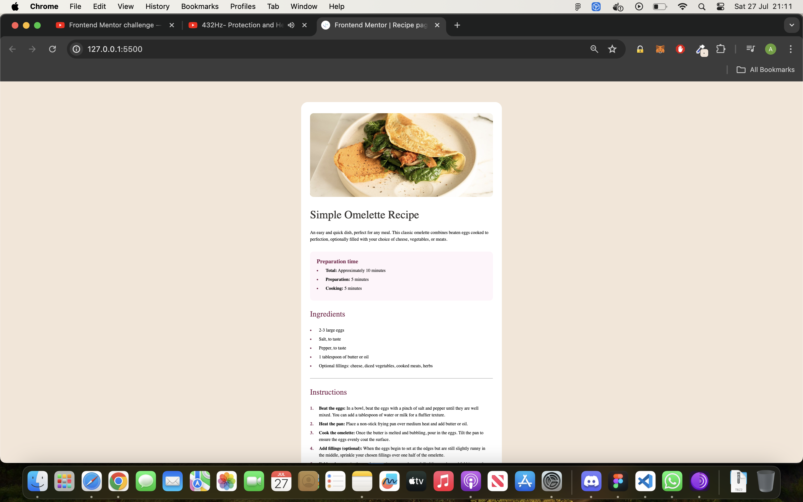

# Frontend Mentor - Recipe page solution

This is a solution to the [Recipe page challenge on Frontend Mentor](https://www.frontendmentor.io/challenges/recipe-page-KiTsR8QQKm). Frontend Mentor challenges help you improve your coding skills by building realistic projects. 

## Table of contents

- [Overview](#overview)
  - [The challenge](#the-challenge)
  - [Screenshot](#screenshot)
  - [Links](#links)
- [My process](#my-process)
  - [Built with](#built-with)
  - [What I learned](#what-i-learned)
  - [Continued development](#continued-development)
  - [Useful resources](#useful-resources)
- [Author](#author)
- [Acknowledgments](#acknowledgments)

## Overview

### Screenshot

### Links

- Solution URL: [Add solution URL here](https://your-solution-url.com)
- Live Site URL: [Add live site URL here](https://your-live-site-url.com)

## My process

### Built with

- Semantic HTML5 markup
- CSS custom properties
- Flexbox
- CSS Grid
- Mobile-first workflow

### What I learned

First attempt of mentour, after using web.dev and kevin powel tutorialls for html and css. also learnt the very basics of github to submit this.

### Continued development

Continue to develop html and css skills, and learn more of github. Then start courses on JS.

### Useful resources

- [MDN docs](https://developer.mozilla.org/en-US/) - This helped me to look up and understand semantic html and css.

## Author

- Website - [Alex B](https://www.your-site.com)
- Frontend Mentor - [@Sharky83](https://www.frontendmentor.io/profile/@Sharky83)

## Acknowledgments

KevinPowell from youtube for his tutorials on html and css to began my journey of learning html and css.

# Frontend-Mentor--Recipe-Page
# Frontend-Mentor--Recipe-Page
